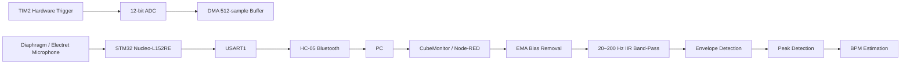
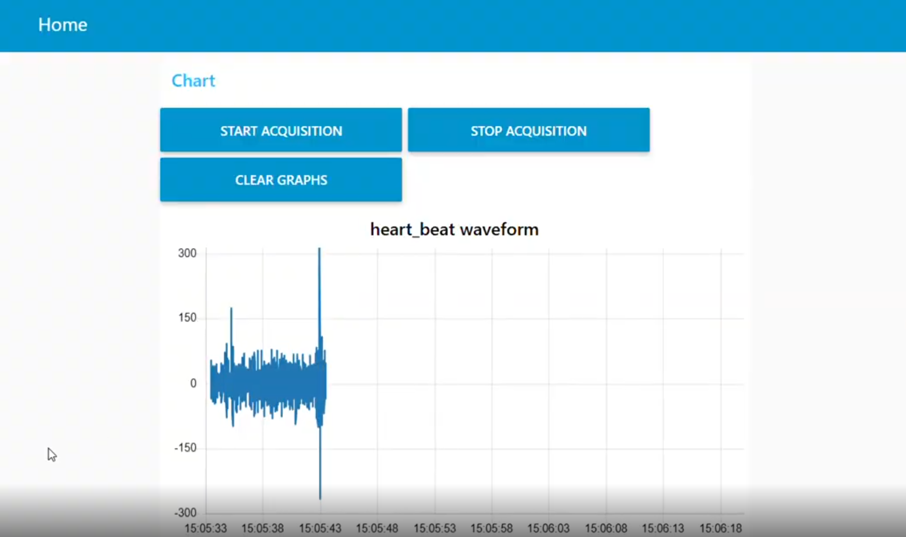
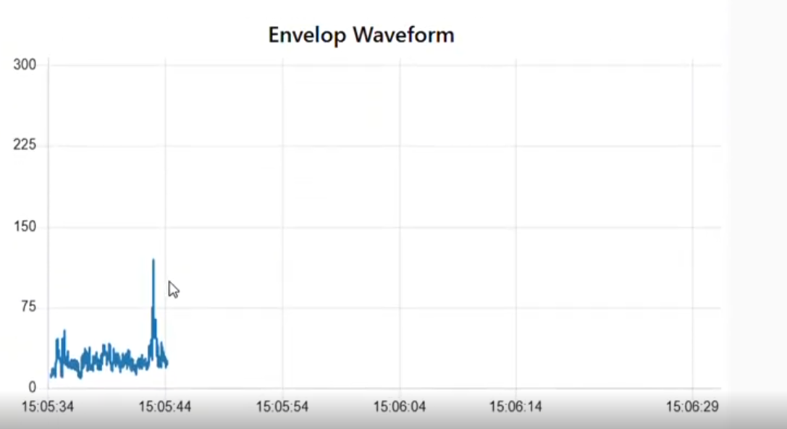
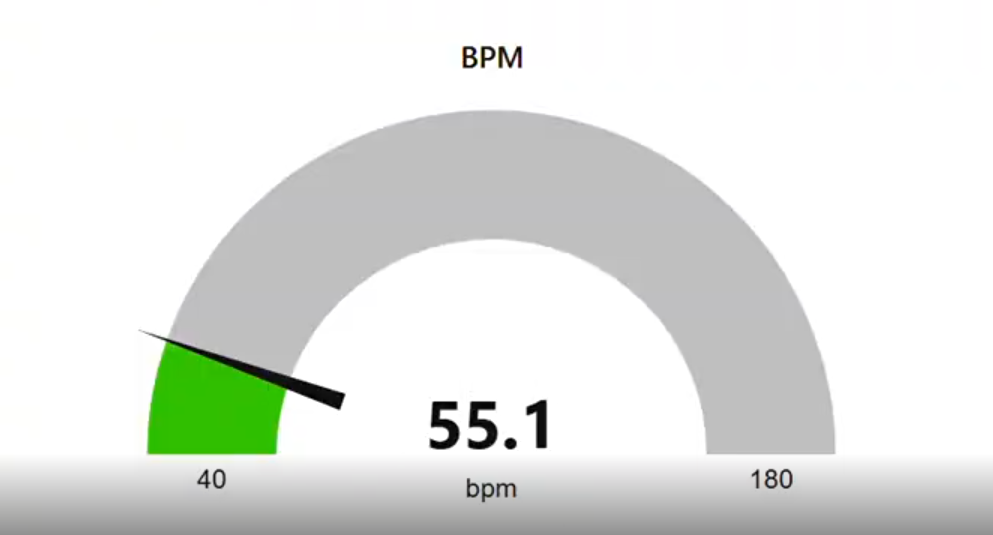
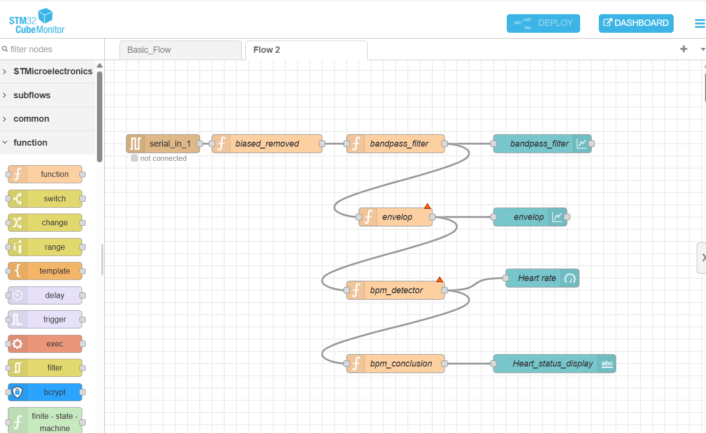

# 🫀 Smart Digital Stethoscope

> **STM32-based real-time heart-sound acquisition, Bluetooth transmission, digital signal processing and BPM estimation**

A compact embedded-systems project that captures heart sounds using a microphone, digitizes the signal with an **STM32 Nucleo-L152RE**, transfers the samples over **HC-05 Bluetooth**, and processes/visualizes the signal using **STM32CubeMonitor / Node-RED**.

## 🎯 Project Objective

The goal is to build a low-cost digital stethoscope that can:

- acquire heart-sound signals in real time,
- maintain a stable sampling rate using hardware timer triggering,
- transfer sampled data wirelessly,
- extract useful heart-sound information through DSP, and
- estimate/display heart rate (BPM).

## 🧩 System Architecture



## 🔧 Hardware

| Component | Purpose |
|---|---|
| **STM32 Nucleo-L152RE** | Embedded acquisition and control |
| **Diaphragm / electret microphone** | Captures heart-sound vibrations |
| **HC-05 Bluetooth module** | Wireless serial transmission |
| **PC/Laptop** | CubeMonitor visualization and DSP |

### Important connections

- Microphone signal → **PA0 / ADC1 channel 0**
- STM32 USART1 TX/RX → **HC-05**
- USART1 → **9600 baud**
- STM32 USB USART2 → **115200 baud** for development/debugging

## ⚙️ Embedded Firmware

The firmware is implemented in **Embedded C using STM32 HAL**.

### ADC acquisition

- ADC resolution: **12-bit**
- ADC input: **ADC1 Channel 0 / PA0**
- Sampling trigger: **TIM2**
- DMA buffer: **512 samples**
- DMA half/full-completion callbacks are used for continuous processing.

### Timer configuration

```text
TIM2 Prescaler = 31
TIM2 Period    = 499
TIM2 TRGO      = Update Event
```

The project is configured for a **1 kHz acquisition rate**.

### DMA processing

The 512-sample DMA buffer is divided into two 256-sample halves.

```text
ADC
 │
 ▼
┌─────────────────────────────────────────┐
│          512-sample DMA buffer          │
├────────────────────┬────────────────────┤
│ First 256 samples  │ Second 256 samples │
│ Half callback      │ Full callback      │
└────────────────────┴────────────────────┘
```

This allows the firmware to transmit data while the ADC continues acquiring samples.

## 📡 Bluetooth Data Transmission

The firmware sends ADC samples through:

```text
USART1 → HC-05 → PC
```

Because the HC-05 link operates at **9600 baud**, the firmware transmits every **8th ADC sample**, giving an effective output stream of approximately **125 samples/s**.

Each transmitted sample is formatted as an ASCII integer followed by CR/LF.

Example:

```text
2048
2051
2060
2074
...
```

## 🧠 Digital Signal Processing

The DSP stage is performed on the PC side using **CubeMonitor / Node-RED**.

### Processing pipeline

```text
Raw ADC Stream
      ↓
EMA Bias Removal
      ↓
20–200 Hz IIR Band-Pass
      ↓
Envelope Extraction
      ↓
Heartbeat Peak Detection
      ↓
BPM Calculation
```

### 1. EMA bias removal

Removes DC offset and slow baseline drift so that the waveform is centered and easier to process.

### 2. 20–200 Hz band-pass filter

The heart-sound band is isolated using an IIR/biquad filter.

This suppresses:

- low-frequency drift/rumble,
- high-frequency noise,
- unwanted environmental components.

### 3. Envelope extraction

The filtered signal is converted into an amplitude envelope using high-pass processing, absolute value and exponential smoothing.

The resulting envelope makes heartbeat events easier to detect.

### 4. BPM estimation

If the detected heartbeat interval is `T` milliseconds:

```text
BPM = 60000 / T
```

## 📊 Results & Actual Dashboard Output

The system was tested end-to-end from embedded acquisition through the
CubeMonitor/Node-RED processing pipeline.

### Raw Heartbeat Waveform

The incoming processed stream shows heartbeat-related signal activity
with environmental/noise components and transient peaks.



### Envelope Waveform

The envelope stage produces a smoother amplitude representation that makes
strong heartbeat events easier to identify for peak detection.



### BPM Gauge

The CubeMonitor dashboard exposes the calculated heart rate through a
real-time BPM gauge. One captured run displayed **55.1 BPM**.



> The displayed 55.1 BPM is an example captured dashboard reading, not a
> clinical measurement. The project report recorded approximately
> **70–90 BPM** across its testing conditions.

### Dashboard / Processing Flow

The actual Node-RED flow used for the PC-side processing is also included:



The flow connects:

```text
Serial Input
     ↓
biased_removed
     ↓
bandpass_filter
     ↓
envelop
     ↓
bpm_detector
     ↓
bpm_conclusion
```

### Reported Performance

| Parameter | Observed / Configured |
|---|---|
| MCU | STM32 Nucleo-L152RE |
| ADC | 12-bit |
| Acquisition rate | 1 kHz |
| DMA buffer | 512 samples |
| Bluetooth | HC-05 |
| Bluetooth baud | 9600 |
| Effective transmitted rate | ~125 samples/s |
| DSP band | 20–200 Hz |
| Reported BPM range | ~70–90 BPM |
| Dashboard window | ~10 seconds |

The project report describes raw signals around **2000–2200 ADC counts**,
filtered waveforms with clearer S1/S2 components, envelope extraction,
and real-time BPM visualization.

## 📁 Repository Structure

```text
Smart_Stethoscope/
│
├── Core/
│   ├── Inc/
│   └── Src/
│
├── Drivers/
│   ├── CMSIS/
│   └── STM32L1xx_HAL_Driver/
│
├── Smart_stethoscope2.ioc
├── STM32L152RETX_FLASH.ld
├── STM32L152RETX_RAM.ld
│
├── docs/
│   └── project_report.pdf
│
├── results/
│   └── README.md
│
├── README.md
└── .gitignore
```

## 🚀 Opening the Project

### Requirements

- STM32CubeIDE
- STM32 Nucleo-L152RE
- STM32CubeMX-compatible STM32 HAL
- Microphone sensor
- HC-05 Bluetooth module
- STM32CubeMonitor / Node-RED for the PC-side processing

### Import into STM32CubeIDE

1. Open **STM32CubeIDE**.
2. Select **File → Import → Existing Projects into Workspace**.
3. Select this repository directory.
4. Build the project.
5. Connect the STM32 Nucleo-L152RE.
6. Flash the firmware.
7. Connect the HC-05 to the STM32 USART1 interface.
8. Pair the HC-05 with the computer.
9. Open the CubeMonitor/Node-RED processing flow.

## 🔬 Technical Highlights

This project demonstrates several important embedded concepts:

- ADC peripheral configuration
- Hardware timer-triggered sampling
- DMA circular/continuous acquisition
- Half-transfer and full-transfer callbacks
- UART communication
- Bluetooth serial communication
- Real-time data streaming
- Digital signal processing
- Envelope detection
- Peak detection
- Physiological parameter estimation

## 🔮 Future Scope

Possible extensions include:

- ML-based murmur detection
- Normal/abnormal heart-sound classification
- Systolic/diastolic classification
- Signal Quality Index
- S1/S2 timing analysis
- Cloud-connected monitoring
- Android/mobile visualization
- Multi-channel auscultation
- Improved analog front-end and MEMS microphone

## ⚠️ Disclaimer

This is an **educational/research prototype** and is not a medical device. The BPM and signal-processing results should not be used for diagnosis or clinical decision-making.

## 👤 Authors

- **Lokesh R**
- Lalithya Krishn
- P A Athithiya

Developed as part of **Embedded System Design** in Electronics and Communication Engineering.

## 📄 Documentation

The detailed project report is available in [`docs/project_report.pdf`](docs/project_report.pdf).
